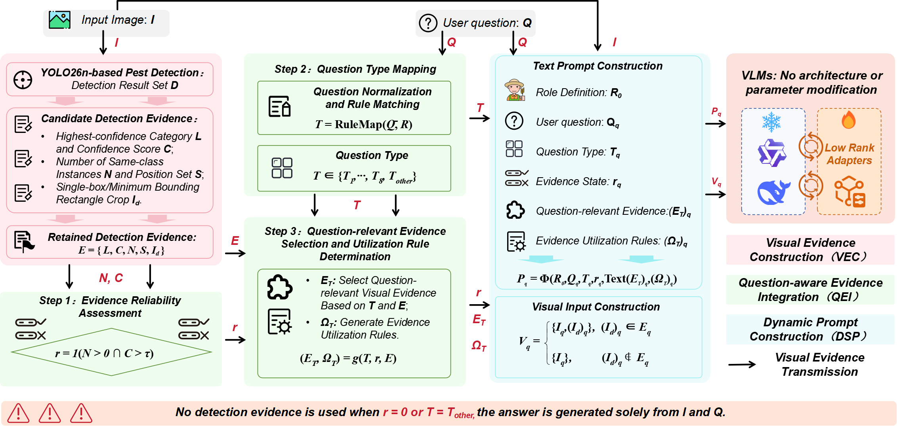

# PestVQA

### A Visual Question Answering Benchmark and Visual Evidence-Guided Prompting Method for Pest Management

  <em>Manuscript submitted to <strong>Computers and Electronics in Agriculture (CEA)</strong> in 2026.</em>

  
  
  
  

---

# 📌 Overview

**PestVQA** is a visual question answering benchmark designed for comprehensive pest understanding and management decision-making.

Unlike conventional pest recognition datasets that mainly focus on classification and localization, PestVQA aims to evaluate whether vision-language models can understand pest-related visual information, extract fine-grained attributes, perform domain-specific reasoning, and provide management-oriented recommendations.

PestVQA integrates:

- **19,007 high-quality pest images**;
- **152,056 image-question-answer triplets**;
- **46 agricultural pest categories**;
- **Five evaluation tasks with corresponding metrics**.

The benchmark covers the complete reasoning process from visual perception to pest management decision-making, providing a unified platform for training and evaluating vision-language models in agricultural pest scenarios.

---

# 📂 Benchmark Components

## Pest Image Collection

The PestVQA image collection contains **19,007 high-quality pest images** covering **46 common agricultural pest categories**.

The images were collected from publicly available datasets and online resources, followed by multi-stage quality control involving automatic filtering and expert verification.

The dataset includes diverse pest appearances, host plants, damage symptoms, illumination conditions, and background environments, providing challenging scenarios for fine-grained pest understanding.

---

## Image-Question-Answer Dataset

Based on the collected pest images, PestVQA constructs **152,056 image-question-answer triplets**.

For each image, questions are organized into **eight question types** across **four cognitive levels**, enabling systematic evaluation of different pest understanding abilities.

| Cognitive Level | Task | Description |
|:---|:---|:---|
| **L1: Visual Perception** | Pest-IC | Pest image captioning |
| | Pest-PJ | Pest presence judgment |
| **L2: Fine-grained Recognition** | Pest-MCQ | Pest identification with multiple choices |
| **L3: Attribute Understanding** | Pest-ATTR | Pest attributes and symptom understanding |
| **L4: Reasoning and Decision-making** | Pest-REA | Pest reasoning and management recommendation |

---

# 📊 Evaluation Tasks

PestVQA establishes five evaluation tasks with unified evaluation protocols:

| Task | Capability Evaluated | Metrics |
|:---|:---|:---|
| **Pest-IC** | Visual pest description | BLEU, ROUGE, METEOR, CIDEr |
| **Pest-PJ** | Pest presence judgment | Accuracy, Token-F1 |
| **Pest-MCQ** | Pest identification | Overall Accuracy, Macro Accuracy |
| **Pest-ATTR** | Pest attribute understanding | Text generation metrics and semantic evaluation |
| **Pest-REA** | Pest reasoning and management decision-making | Knowledge consistency and decision rationality |

These tasks evaluate LVLMs from basic visual understanding to professional pest management reasoning.

---

# 🌱 Visual Evidence-Guided Prompting

Besides the benchmark, PestVQA introduces **Visual Evidence-Guided Prompting (VEG-Prompt)**, a training-free and plug-and-play approach for improving LVLM performance in pest management scenarios.

VEG-Prompt consists of:

- **Visual Evidence Construction (VEC):** extracting image-related evidence;
- **Question-aware Evidence Integration (QEI):** selecting reliable evidence according to question types;
- **Dynamic System Prompting (DSP):** generating adaptive prompts for LVLM inference.

By explicitly incorporating reliable visual evidence, VEG-Prompt improves pest recognition, attribute understanding, and management reasoning.

---

# 📥 Dataset Access

At the current stage, this repository releases the **PestVQA test set only**.

## Test Set Download

- **Download link:**  
  https://pan.quark.cn/s/1bd1f57389dd

- **Quark share code:**  
  `/~df933ZZBis~:/`

The dataset can be accessed by opening the link directly or searching the share code in the Quark Drive application.

> [!IMPORTANT]
> The training and validation sets are temporarily unavailable during manuscript review.
> The complete PestVQA dataset will be released on **Hugging Face** after the paper is officially accepted.

---

# 🖼️ Benchmark Overview

<strong>Figure 1.</strong>  Task system and text statistics of PestVQA.

 

<strong>Figure 2.</strong> Representative samples from PestVQA.

 

<strong>Figure 3.</strong> Workflow of the VEG-Prompt method.

---

# 🚀 Release Plan

- [x] Release PestVQA test set
- [ ] Release training set
- [ ] Release validation set
- [ ] Release complete image-question-answer annotations
- [ ] Release pest knowledge base
- [ ] Release evaluation scripts
- [ ] Release VEG-Prompt implementation code
- [ ] Release complete dataset on Hugging Face after paper acceptance

---

### ⭐ If PestVQA is useful for your research, please consider starring this repository.

