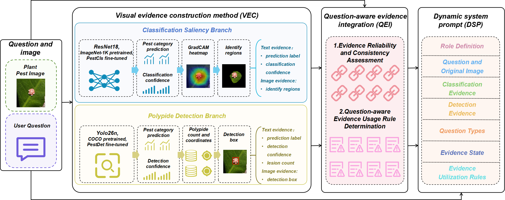
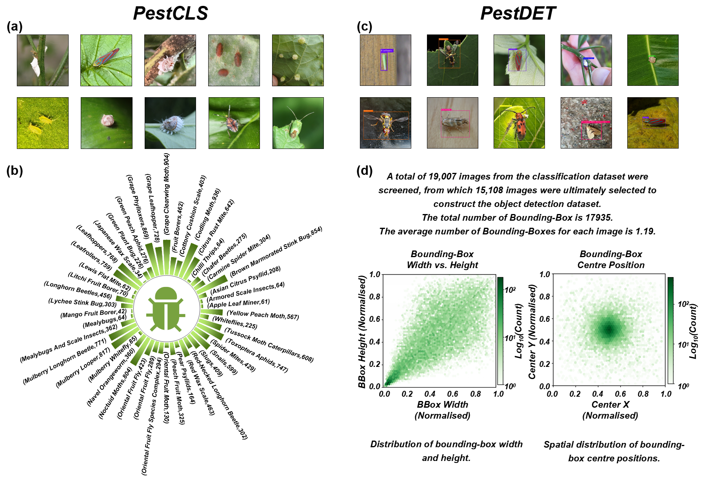
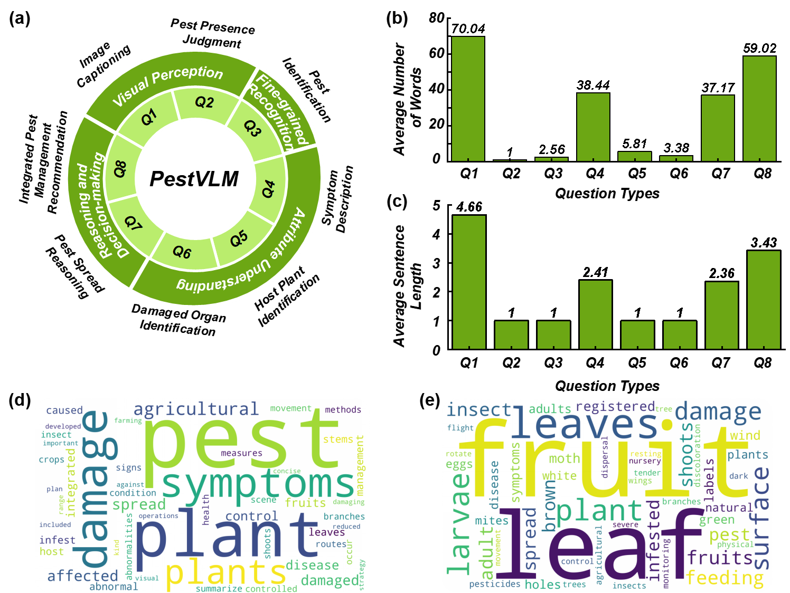
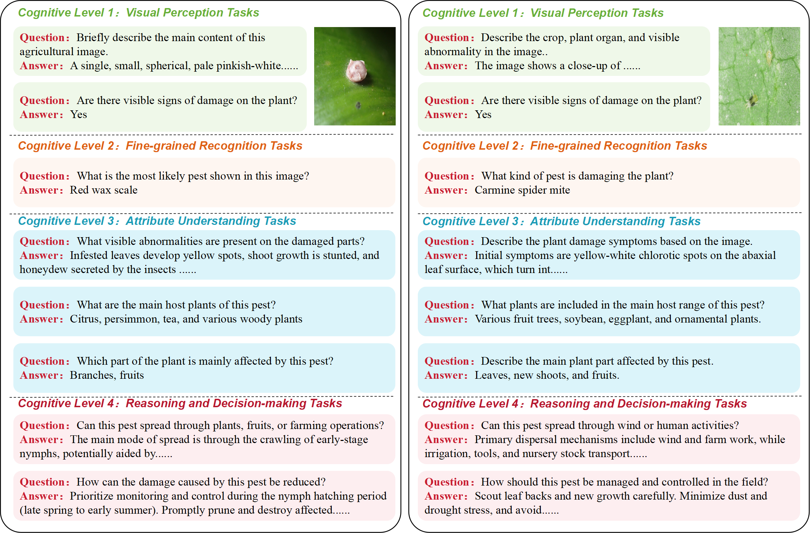

# PestMMD

### A Multi-modal Multi-task Dataset and Pest-Evidence Guided Prompting Method for Pest Understanding

  <em>Manuscript submitted to <strong>Computers and Electronics in Agriculture (CEA)</strong> in 2026.</em>

  
  
  
  

---

## 📌 Overview

**PestMMD** is a multi-modal and multi-task dataset developed for comprehensive plant pest understanding. It integrates pest image classification, pest object detection, and pest-oriented visual question answering under a unified taxonomy of **46 common agricultural pest categories**.

PestMMD supports research on:

- Fine-grained pest image classification;
- Pest detection and localization in complex agricultural environments;
- Understanding of pest symptoms, host plants, and damaged organs;
- Reasoning about pest spread and dispersal;
- Generation of Integrated Pest Management recommendations;
- Vision-language reasoning guided by explicit pest evidence.

The complete PestMMD dataset consists of three subsets:

| Subset | Task | Scale |
|:---|:---|---:|
| **PestCLS** | Pest image classification | 19,007 images |
| **PestDET** | Pest object detection | 15,108 annotated images |
| **PestUCD** | Pest understanding and decision-making VQA | 152,056 question-answer pairs |
| **Taxonomy** | Unified pest categories | 46 categories |

PestUCD contains eight question types organized into four cognitive levels, covering the complete reasoning process from basic visual perception to pest management decision-making.

---

## 📂 Dataset Components

### PestCLS

PestCLS contains **19,007 pest images** covering 46 common agricultural pest categories. The images exhibit diverse pest scales, viewing angles, host plants, illumination conditions, and background environments.

PestCLS is designed to evaluate fine-grained pest recognition in both controlled and complex agricultural scenes.

### PestDET

PestDET contains **15,108 images** with manually reviewed pest bounding-box annotations. During dataset construction, only images containing clearly visible and spatially identifiable pest individuals were retained.

The annotations are provided in the YOLO format. PestDET supports pest detection and localization research, particularly under challenging conditions involving small objects, occlusion, and complex backgrounds.

### PestUCD

PestUCD is a pest-oriented visual question-answering dataset constructed from the 19,007 pest images. Each image is associated with eight question types organized into four cognitive levels:

| Cognitive Level | Question Type |
|:---|:---|
| **L1: Visual Perception** | Image Captioning |
|  | Pest Presence Judgment |
| **L2: Fine-grained Recognition** | Pest Identification |
| **L3: Attribute Understanding** | Symptom Description |
|  | Host Plant Identification |
|  | Damaged Organ Identification |
| **L4: Reasoning and Decision-making** | Pest Spread Reasoning |
|  | Integrated Pest Management Recommendation |

PestUCD contains **152,056 image-question-answer pairs**. The answers were generated or selected under the constraints of a manually reviewed pest knowledge base to ensure professional accuracy and semantic consistency.

---

## 📥 Dataset Access

At the current stage, this repository releases the **PestMMD test set only**.

### Test Set Download

The test set is temporarily hosted on Quark Drive:

- **Download link:** https://pan.quark.cn/s/1bd1f57389dd
- **Quark share code:** `/~df933ZZBis~:/`

The dataset can be accessed by opening the download link directly or by copying the complete share code into the Quark Drive application.

> [!IMPORTANT]
> The PestMMD training and validation sets are not publicly available while the associated manuscript is under review. The complete dataset will be released on **Hugging Face** after the paper is officially accepted.

---

## 🖼️ Dataset Overview

  <strong>Figure 1.</strong> Overall framework of the pest-evidence guided prompting method.

 

  <strong>Figure 2.</strong> Representative samples and data distributions of PestCLS and PestDET.

 

  <strong>Figure 3.</strong> Task hierarchy, cognitive levels, and textual statistics of PestUCD.

 

  <strong>Figure 4.</strong> Representative image-question-answer samples from PestUCD.

---

## 🚀 Release Plan

- [x] Release the PestMMD test set
- [ ] Release the complete PestCLS dataset
- [ ] Release the complete PestDET dataset and annotations
- [ ] Release the complete PestUCD dataset
- [ ] Release the pest knowledge base
- [ ] Release standardized metadata and data split files
- [ ] Release training and evaluation code
- [ ] Release the complete dataset on Hugging Face after paper acceptance

The Hugging Face dataset link will be added to this repository after the associated paper is officially accepted.

---

### ⭐ If PestMMD is useful for your research, please consider starring this repository.

